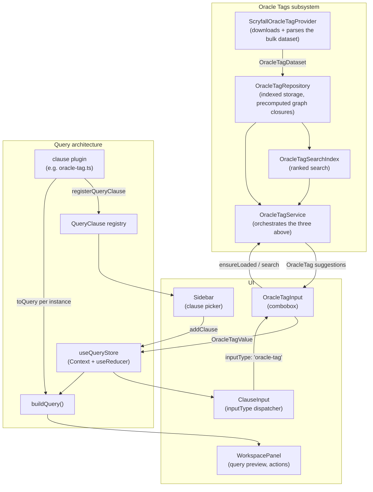

# Scryfall Studio — Architecture

Reference document for how the app is built and why. Update it when the
shape of the code changes — it should never drift far from reality.

## Vision

Scryfall Studio is a visual IDE for the Scryfall Query Language: it helps
users discover, compose, and understand Scryfall search queries, and always
redirects them back to Scryfall itself rather than competing with it. The
generated query string is the primary artifact; the UI is one way of
editing it.

## Data flow

## Layers

### QueryClause & Registry — the core, from day one

Everything the app can add to a query is a `QueryClause` (`src/clauses/types.ts`):
id, label, category, icon, operator, `inputType`, `defaultValue`,
`toQuery(value)`, and optional `validate`/`metadata`/`fromQuery`.

Each clause lives in its own file under `src/clauses/plugins/` and
self-registers via `registerQueryClause()` (`src/clauses/registry.ts`) as a
side effect of being imported by `src/clauses/plugins/index.ts`. The
registry groups clauses by category and powers the sidebar's list and
search — nothing about the UI hardcodes which clauses exist.

**Adding a clause is: one new file + one import line.** Nothing else
changes, unless it needs a genuinely new `inputType`.

Only Oracle Text and Oracle Tag are registered today. Commander Identity,
Legality, and Game exist as working clause files but aren't registered —
Scryfall's own Advanced Search already covers them well; re-enabling any of
them is a two-line change in `plugins/index.ts`.

### Query building and state

- `QueryClauseInstance` (`src/query/types.ts`): `{ instanceId, clauseId, value }` — the
  clause definition and the user's chosen value are kept separate.
- `buildQuery()` (`src/query/buildQuery.ts`): concatenates each instance's
  `clause.toQuery(value)`. **No React component ever builds a query string
  by hand** — that's the one rule the whole architecture protects.
- `useQueryStore` (`src/store/useQueryStore.tsx`): a Context + `useReducer`
  store holding the instance list plus an optionally-imported base query
  (pasted Scryfall URL, kept opaque, with its non-`q` params preserved
  verbatim). No external state library.

### Oracle Tags subsystem — the first "semantic dataset"

Oracle Tags need more than a plain string: the official dataset gives every
tag an id, label, description, aliases, and a parent/child graph. That's
handled by `src/services/oracleTags/`, split into four responsibilities:

| File | Responsibility |
|---|---|
| `ScryfallOracleTagProvider.ts` | Knows how to fetch the dataset (Scryfall's `bulk-data` API → gzip JSONL) and parse it into `OracleTag[]`. Nothing else in the app knows this detail. |
| `OracleTagRepository.ts` | Indexes tags by id and slug; precomputes full ancestor/descendant closures once at construction, so hierarchy lookups are O(1) afterward. |
| `OracleTagSearchIndex.ts` | Ranked search over the repository: label startsWith → slug startsWith → alias startsWith → label contains → description contains. |
| `OracleTagService.ts` | Thin orchestration — the only thing UI code imports. Wires Provider → Repository → SearchIndex and exposes `ensureOracleTagsLoaded()`, `searchOracleTags()`, `getOracleTagById/BySlug`, `getOracleTagChildren/Parents/Descendants/Ancestors`. |
| `recentOracleTags.ts` | Small, separate localStorage-backed list of recently-selected tags. Deliberately not folded into the search index — it's session/UI state, not a "finding data" concern. |

The dataset (~5.6 MB compressed) is fetched **lazily, on first focus** of an
Oracle Tag field — never at app startup. This is a deliberate, load-bearing
decision; don't change the trigger point without a reason.

### UI

`ClauseInput` (`src/components/clauses/ClauseInput.tsx`) is a dispatcher: it
switches on `clause.inputType` and renders the matching widget (`text`,
`select`, `color-multiselect`, `oracle-tag`). Domain-specific widgets like
`OracleTagInput` live in their own folder (`src/components/oracle-tags/`)
rather than inside the generic `clauses/` component tree, so the dispatcher
never needs to know how any one widget works internally.

## Current known simplifications (intentional, not oversights)

The app has exactly one semantic dataset today, so a few things are
simpler than the long-term direction below describes on purpose:

- `OracleTagService` directly imports and instantiates its Provider and
  Repository (module-level singletons), rather than receiving them via
  constructor injection.
- Nothing is generalized beyond Oracle Tags — there's no `SemanticProvider<T>`
  or `SemanticSearchIndex<T>` abstraction yet.

Neither is a mistake to fix preemptively. They're exactly what you'd expect
a single-provider MVP to look like, and the boundaries described above
(Provider / Repository / SearchIndex / Service) already make the
generalization below straightforward *when a second provider is actually
needed* — not before.

## Long-term direction (not yet implemented)

Guidance for when the app grows past one semantic dataset. None of this
should be built speculatively — it's here so later decisions don't
accidentally make it harder to get to.

- **Generic `SemanticProvider<T>`**: Oracle Tags is the first of what could
  eventually include Art Tags, Keywords, Ability Words, Creature Types,
  Scryfall Catalogs, or community/custom datasets. When a second one shows
  up, extract the shared shape (load, metadata, lookup by id/slug, search,
  hierarchy-when-applicable) rather than copy-pasting the Oracle Tags
  subsystem.
- **`DatasetMetadata`**: an `{ id, version, updatedAt, source }` shape,
  independent of dataset contents, so multiple datasets can be reasoned
  about (freshness, cache invalidation) uniformly.
- **Multiple providers registered side by side**, the same way clauses
  register into the `QueryClause` registry today.
- **`SemanticSearchIndex<T>`**: separate ranking infrastructure from
  Oracle-Tags-specific ranking rules, once a second dataset needs its own
  ranking logic.
- **Constructor injection** for services, once there's more than one
  provider/repository pair to wire up — no IoC container, just passing
  dependencies in instead of importing and instantiating them inline.
- **Replaceable repositories**: if datasets ever update while the app is
  open, a repository instance should be swappable without a UI reload —
  avoid baking in assumptions that prevent that later (e.g. don't let
  components hold long-lived references into repository internals).
- **Inspector as provider-driven UI**: when built, it should render
  whatever metadata a provider exposes, not know about Oracle Tags
  specifically.
- **`fromQuery()`** (reverse parsing, reserved on `QueryClause` but unused)
  should resolve slugs via `provider.resolveSlug()`-style calls rather than
  Oracle-Tag-specific parsing, once it's built.
- **AI-assisted query building** (e.g. "find cards that draw when creatures
  enter" → suggested Oracle Tags/Oracle Text → built query) is a plausible
  long-term feature this layering should stay compatible with — nothing
  about the current design should need to change to support it later.

## Adding a new clause (how-to)

1. Create `src/clauses/plugins/<clause-id>.ts` implementing `QueryClause`.
2. Import it (for its registration side effect) in `src/clauses/plugins/index.ts`.
3. If it needs a new `inputType`, add the literal to `QueryClauseInputType`
   (`src/clauses/types.ts`) and a matching case in `ClauseInput.tsx`.
4. That's it — the sidebar, search, and query building pick it up
   automatically.
